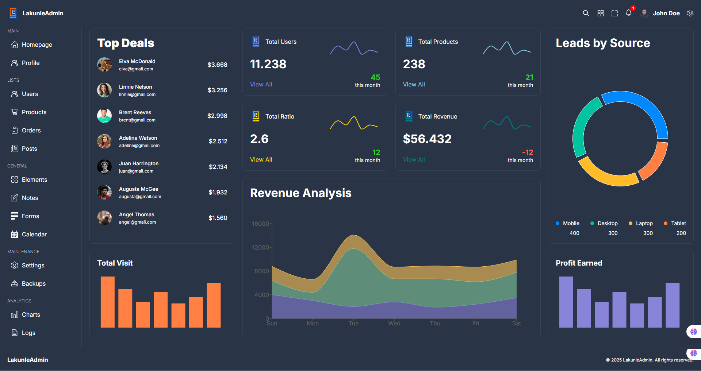

# React Admin Dashboard

A modern, responsive admin dashboard built with React, TypeScript, and Material UI. This project provides a comprehensive solution for managing users, products, and other business data with a beautiful and intuitive interface.



## Features

- 📱 **Fully Responsive Design**

  - Mobile-first approach
  - Adapts to all screen sizes
  - Optimized for desktop, tablet, and mobile

- 🎨 **Modern UI/UX**

  - Clean and intuitive interface
  - Material UI components
  - Custom styling with SCSS
  - Dark/Light theme support

- 📊 **Data Management**

  - User management (CRUD operations)
  - Product management
  - Interactive data tables
  - Real-time data updates

- 📈 **Analytics & Charts**

  - Revenue analytics
  - User statistics
  - Product performance metrics
  - Interactive charts

- 🔒 **Authentication**
  - Secure login system
  - Protected routes
  - User session management

## Tech Stack

### Frontend

- React 18
- TypeScript
- Material UI
- React Router v6
- React Query
- SCSS
- Recharts

### Backend

- Node.js
- Express.js
- RESTful API
- CORS enabled

## Prerequisites

Before you begin, ensure you have the following installed:

- Node.js (v14 or higher)
- npm or yarn
- Git

## Installation

1. Clone the repository:

```bash
git clone https://github.com/yourusername/react-admin-dashboard.git
cd react-admin-dashboard
```

2. Install frontend dependencies:

```bash
npm install
```

3. Install backend dependencies:

```bash
cd backend
npm install
```

## Running the Application

1. Start the backend server:

```bash
cd backend
npm run server
```

2. In a new terminal, start the frontend:

```bash
npm start
```

3. Open your browser and navigate to:

```
http://localhost:3000
```

## Project Structure

```
react-admin-dashboard/
├── src/
│   ├── components/     # Reusable components
│   ├── pages/         # Page components
│   ├── styles/        # Global styles
│   ├── data/          # Mock data
│   └── App.tsx        # Main application component
├── backend/
│   ├── routes/        # API routes
│   ├── controllers/   # Route controllers
│   └── app.js         # Express application
└── public/            # Static files
```

## Available Scripts

- `npm start` - Runs the frontend in development mode
- `npm run server` - Starts the backend server
- `npm run build` - Builds the app for production
- `npm test` - Runs the test suite

## API Endpoints

### Users

- `GET /api/users` - Get all users
- `GET /api/users/:id` - Get user by ID
- `POST /api/users` - Create new user
- `PUT /api/users/:id` - Update user
- `DELETE /api/users/:id` - Delete user

### Products

- `GET /api/products` - Get all products
- `GET /api/products/:id` - Get product by ID
- `POST /api/products` - Create new product
- `PUT /api/products/:id` - Update product
- `DELETE /api/products/:id` - Delete product

## Contributing

1. Fork the repository
2. Create your feature branch (`git checkout -b feature/AmazingFeature`)
3. Commit your changes (`git commit -m 'Add some AmazingFeature'`)
4. Push to the branch (`git push origin feature/AmazingFeature`)
5. Open a Pull Request

## License

This project is licensed under the MIT License - see the [LICENSE](LICENSE) file for details.

## Acknowledgments

- [Material UI](https://mui.com/)
- [React Query](https://tanstack.com/query/latest)
- [Recharts](https://recharts.org/)
- [React Router](https://reactrouter.com/)

## Contact

Your Name - [@AdioOlakunleEn1](https://twitter.com/AdioOlakunleEn1)
Project Link: [https://github.com/Olakunleniola/React-Dashboard-App-1](https://github.com/Olakunleniola/React-Dashboard-App-1)
